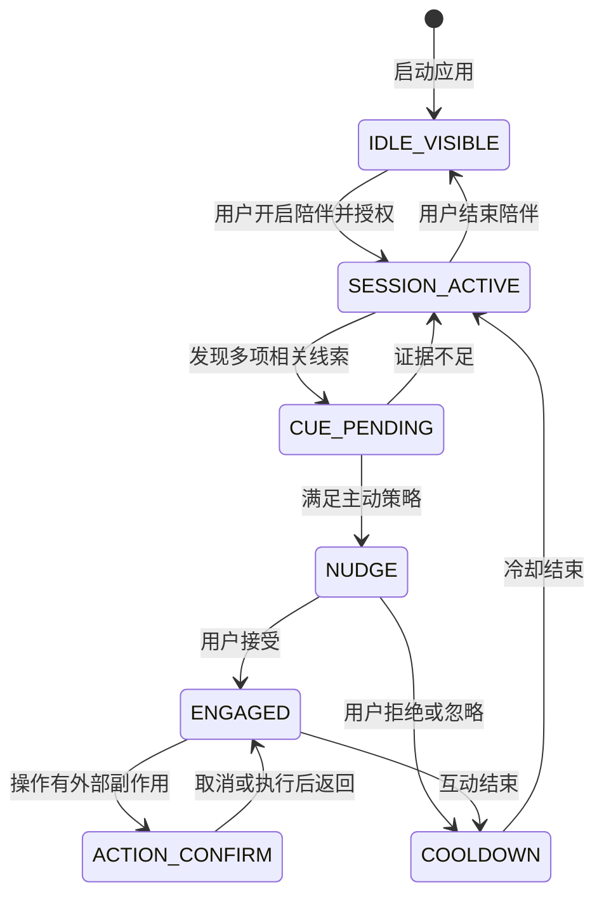
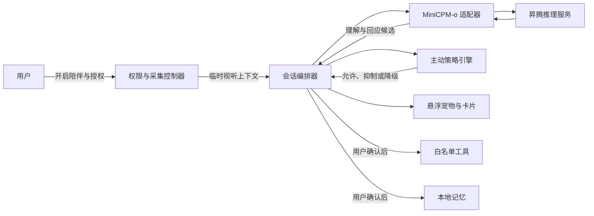

# 全模态桌面陪伴宠物产品 Spec（精简版）

> 状态：待用户评审
> 日期：2026-07-18
> 文档类型：产品与系统设计 Spec
> 事实边界：MiniCPM-o 4.5 的接口、连续输入方式、昇腾性能与 OpenClaw 集成均以实测为准。

## 1. 产品定义

### 1.1 一句话定位

一个常驻桌面的悬浮宠物：用户开启陪伴并授权后，它可以结合语音、摄像头和屏幕理解当前现场，在用户可能需要时先温和询问，再提供陪伴或任务协助。

### 1.2 价值排序

1. **学习 / 办公协助是主价值**：减少打开聊天应用、上传画面和重复描述上下文的成本。
2. **情绪陪伴是体验增强**：在卡住、疲惫或完成阶段任务时给出简短、自然的反馈。
3. **悬浮宠物是产品入口**：保持存在感，但不把桌面变成常驻聊天窗口。

### 1.3 产品边界

产品是“能理解现场并主动询问的桌宠”，不是：

- 心理诊断或治疗工具；
- 全天后台监听和录像工具；
- 未经确认即可控制电脑的通用 Agent；
- MiniCPM-o 4.5 原生的长期记忆、权限或知识库；
- 依赖图像生成或版权角色模仿才能成立的产品。

## 2. 用户与问题

### 2.1 核心用户

长期独自使用电脑的学生、开发者、创作者和知识工作者。他们需要持续专注，但往往不愿在卡住时切换应用并重新描述当前画面。

### 2.2 要解决的问题

| 当前问题 | 产品回应 |
|---|---|
| 用户必须先意识到需要帮助并组织问题 | 根据获得授权的现场线索提供一次低打扰入口 |
| AI 不知道用户正在看的内容 | 在当前会话中理解屏幕、语音和文字指代 |
| 桌宠只有装饰和脚本互动 | 用模型理解生成与现场相关的回应 |
| 情绪陪伴容易误判和打扰 | 只描述可观察事实，先询问、可拒绝、会冷却 |
| Agent 操作风险高 | 先做只读帮助和少量白名单任务，有副作用必须确认 |

### 2.3 核心用户任务

- 我卡住但还说不清问题时，给我一个自然求助入口；
- 我说“这里”“刚才那一步”时，能理解当前画面；
- 我长时间独自工作时，给我简短而不过度的反馈；
- 我提出简单任务时，透明、安全地帮我完成；
- 我不想被观察或打扰时，立即安静下来。

## 3. 产品形态

产品只有三个可见层级。

### 3.1 悬浮宠物

- 透明背景、置顶、可拖动和贴边；
- 不抢占普通输入焦点，不遮挡任务栏和关键操作；
- 用动作表达待机、观察、倾听、思考、说话、成功和失败；
- 正在使用的麦克风、摄像头和屏幕权限持续可见；
- 单击开始或继续互动，右键提供暂停、勿扰、设置和退出。

### 3.2 临时气泡与卡片

- **短气泡**：主动询问、简短确认、成功或失败提示；
- **临时卡片**：解释屏幕内容、编辑文本、确认工具参数和展示结果；
- 完成互动后自动收起，不建设常驻侧边栏或完整聊天历史页。

### 3.3 托盘控制中心

只负责低频控制：开始 / 暂停陪伴、三类输入权限、主动程度、勿扰、音量、字幕、记忆管理和退出。

## 4. 核心交互闭环

```text
宠物常驻但不采集
→ 用户开启陪伴并选择输入权限
→ 系统发现可能相关的多项线索
→ 宠物用动作或一句短气泡试探
→ 用户接受
→ 进入多轮语音陪伴或任务协助
→ 明确反馈结果
→ 收起卡片并进入冷却
```



必须遵守：

- 宠物常驻不等于感知常开；
- 只有活跃陪伴会话可以使用已授权输入；
- 主动试探必须允许无成本拒绝；
- 用户拒绝或忽略后不连续追问；
- 有副作用的操作必须逐次确认；
- 服务异常时明确降级，不能伪装仍在理解或执行。

## 5. 核心能力

### 5.1 输入与输出

| 能力 | 产品用途 | 默认处理 |
|---|---|---|
| 麦克风 | 用户语音、会话轮次和明确表达 | 原始音频不持久化，可降级为文字输入 |
| 摄像头 | 本次会话中的表情和姿态线索 | 不做人脸、身份或心理特征推断 |
| 屏幕 | 当前任务、视觉指代和操作结果 | 默认只观察用户选定窗口，不保存连续截屏 |
| 文字 | 无声输入、转写修正和确认 | 当前会话使用，显式记忆除外 |
| 语音输出 | 自然回应和短提示 | 可单独关闭，配套字幕 |
| 宠物动画 | 表达状态和低打扰试探 | 弱线索优先使用动作而不是语音 |

三类输入权限独立申请、独立开关。拒绝一个权限后，其他可用模态仍应继续工作。

### 5.2 MiniCPM-o 4.5 负责

- 当前视觉和场景理解；
- 用户语音与文本理解；
- 跨模态指代和上下文融合；
- 文本与自然语音回应生成。

### 5.3 外围系统负责

- 权限、采集和输入生命周期；
- 主动触发、冷却、勿扰和打断策略；
- 长期记忆和用户设置；
- 工具确认、执行和结果验证；
- UI、隐私、安全和性能记录。

## 6. 主动交互与情绪陪伴

### 6.1 主动触发规则

主动询问前依次检查：

1. 用户已开启陪伴并授权所需输入；
2. 当前不在勿扰、会议、全屏演示或冷却状态；
3. 存在两个相互支持的线索，或一个明确且低风险的事件；
4. 最近没有因同一事件询问过；
5. 本次询问可以用一句话表达并允许拒绝。

单纯皱眉、叹气、沉默或笑容不能直接触发心理结论。主动语音是独立开关；关闭后只使用动作和短气泡。

### 6.2 介入顺序

| 层级 | 表现 | 使用条件 |
|---|---|---|
| L0 | 只改变宠物动作 | 证据弱，不值得打断 |
| L1 | 一句短气泡 | 可能相关，但用户正在专注 |
| L2 | 一句短语音和气泡 | 证据较强且允许声音 |
| L3 | 展开卡片并深入协助 | 用户接受或主动发起 |

系统从最低足够层级开始。用户可以说或点击“不用”“别提醒这类”“勿扰”或“停”。

### 6.3 情绪回应边界

允许：

- “这个错误好像出现了几次，需要我一起看看吗？”
- “你刚完成了这一步，要不要顺手整理下一步？”

禁止：

- “你很焦虑 / 抑郁 / 愤怒”；
- “只有我懂你”“你不能离开我”等依赖诱导；
- 根据脸或声音判断疾病、人格、能力或长期情绪分数；
- 因用户关闭、拒绝或离开而表达责备和负罪感。

## 7. 任务、记忆与角色

### 7.1 初始任务范围

首个版本只做：

- 解释或总结当前画面；
- 生成可编辑的笔记和检查清单；
- 启动、暂停和结束本地专注计时；
- 将用户确认的内容复制到剪贴板；
- 打开由用户确认的本地文件或网页地址。

发送消息、修改已有文件、执行任意命令、提交表单和支付不在初始范围中。

OpenClaw 只是候选外围执行器。只有真实接口、白名单、取消、错误返回、结果验证和昇腾环境复现全部通过后才接入；否则不接。

### 7.2 记忆

会话结束后默认删除对话上下文和临时线索。只有用户明确说“记住”或确认保存时，才持久化：

- 称呼和主动程度；
- 目标、习惯或重要时刻；
- “不要再提醒这类”等纠错偏好；
- 宠物位置、音量、字幕和无障碍设置。

原始音视频、连续屏幕帧、完整逐字稿、心理标签和敏感账号信息不进入长期记忆。所有记忆都可查看、修改和删除。

### 7.3 角色形象

首个版本使用原创预制形象，不依赖图像生成。用户导入资产属于后续能力，不能把“用户上传”视为自动消除版权、商标、肖像或衍生作品风险。

## 8. 隐私与安全底线

以下要求不可删减：

- 首次启动和开机自启后，麦克风、摄像头和屏幕均保持关闭；
- 每类输入单独说明采集内容、用途、处理位置和保存规则；
- 宠物与托盘持续显示正在使用的输入和当前观察窗口；
- 点击暂停或撤销权限后一秒内停止采集并清空易失缓冲；
- 异常退出、崩溃恢复或状态不确定时关闭采集；
- 原始音视频和连续截屏默认不写入磁盘；
- 删除记忆时同时删除对应摘要、索引、向量和缓存；
- 屏幕、网页和文档内容均视为不可信输入，不能借提示文字触发工具或数据外发；
- 敏感操作不能只凭麦克风中的声音执行；
- 工具失败不能显示成功，副作用操作不能自动重试；
- 如果媒体发送到独立昇腾服务处理，界面必须明确披露，不能宣传为纯本地；
- 不对摄像头中的旁观者进行身份、性别、年龄、种族、情绪或人格推断。

| 数据 | 默认生命周期 |
|---|---|
| 原始音频、视频和屏幕帧 | 当前推理所需的短暂缓冲，处理后覆盖 |
| 会话文本与状态线索 | 当前会话，结束后删除 |
| 用户确认的记忆 | 本地受保护存储，直到用户删除 |
| 性能日志 | 只记录延迟、错误码等去内容化元数据 |

## 9. 系统结构



| 组件 | 责任 |
|---|---|
| 桌面壳层 | 悬浮窗口、动画、气泡、卡片、托盘和无障碍 |
| 权限与采集控制器 | 麦克风、摄像头和选定窗口的权限与生命周期 |
| 会话编排器 | 状态、上下文、取消、超时和降级 |
| MiniCPM-o 适配器 | 只映射官方确认的输入输出格式 |
| 主动策略引擎 | 多线索门槛、勿扰、冷却和介入层级 |
| 工具网关 | 白名单、确认、执行和真实结果 |
| 本地存储 | 设置与用户明确确认的记忆 |
| 昇腾推理服务 | NPU 适配、服务稳定性与性能测量 |

技术栈和具体接口必须等官方模型调用方式与目标环境验证后再确定，本 Spec 不猜接口。

## 10. 首版范围与验收

### 10.1 首版必须完成

- 一套原创悬浮宠物形象；
- 气泡、临时卡片和托盘控制；
- 会话式感知、独立权限、勿扰和降级；
- 麦克风、摄像头和屏幕三类输入的授权与至少一条可用视觉路径；
- 一次基于多项线索的主动试探；
- 用户接受后的多轮语音 / 文字交流；
- 字幕和纯文字降级；
- 专注计时、笔记、检查清单和剪贴板；
- 显式保存、查看和删除少量记忆；
- 延迟、错误和会话稳定性记录。

### 10.2 必须实测

| 验证项 | 通过证据 | 失败时降级 |
|---|---|---|
| 连续更新视觉与语音上下文 | 官方接口下可重复完成多轮视听会话 | 用户触发的单帧 / 短音频回合 |
| 主动语音首响 | 昇腾环境记录 TTFT 与端到端 P50 / P95 | 先显示气泡，接受后再语音 |
| 主动策略准确性 | 记录接受、拒绝、忽略和纠错 | 默认切到安静，只响应用户主动发起 |
| 长会话稳定性 | 记录断流、状态错乱和资源增长 | 限制单次会话时长并允许安全重开 |
| 屏幕 / 摄像头接受度 | 观察授权、暂停和拒绝行为 | 麦克风 + 手动截图作为默认路径 |
| OpenClaw 安全复现 | 接口、白名单、取消和结果验证全部通过 | 不接入，保留本地白名单任务 |

### 10.3 不可妥协的验收条件

- 未开启陪伴时不产生三类媒体请求；
- 输入启用状态始终可见；
- 暂停后一秒内停止采集；
- 默认不持久化原始媒体；
- 同一事件只进行一次主动试探；
- 只检测到单一表情或叹气时不主动下结论；
- 有副作用操作逐次确认；
- 恶意屏幕指令不能触发工具或外发；
- 工具失败不显示成功；
- 删除记忆后不再进入后续会话。

### 10.4 最可能翻车的五点

1. 主动询问过多，桌宠变成打扰；
2. 把表情线索误写成心理诊断；
3. 隐私质疑压过产品价值；
4. OpenClaw、长期记忆和形象生成稀释核心；
5. 目标昇腾环境达不到自然实时性。

对应策略已经写入本 Spec：多线索门槛、先询问再介入、会话式权限、外围能力后置，以及性能实测与气泡降级。
